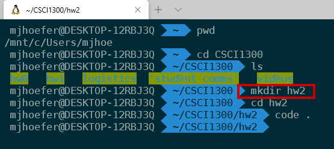
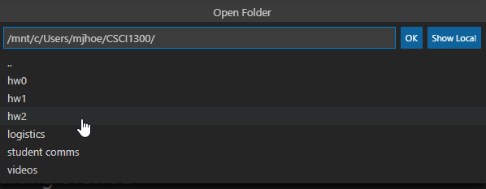
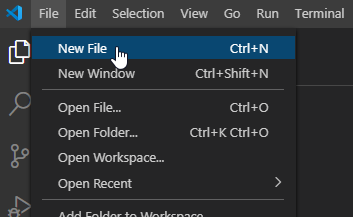
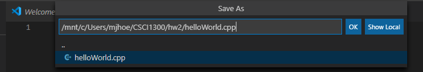
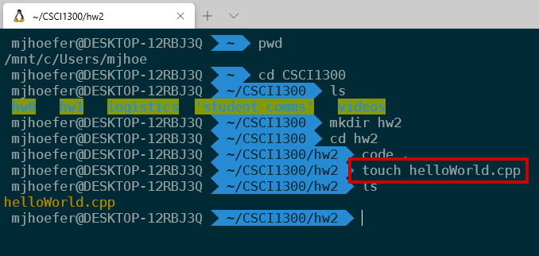
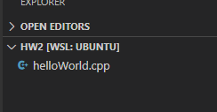
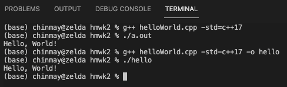
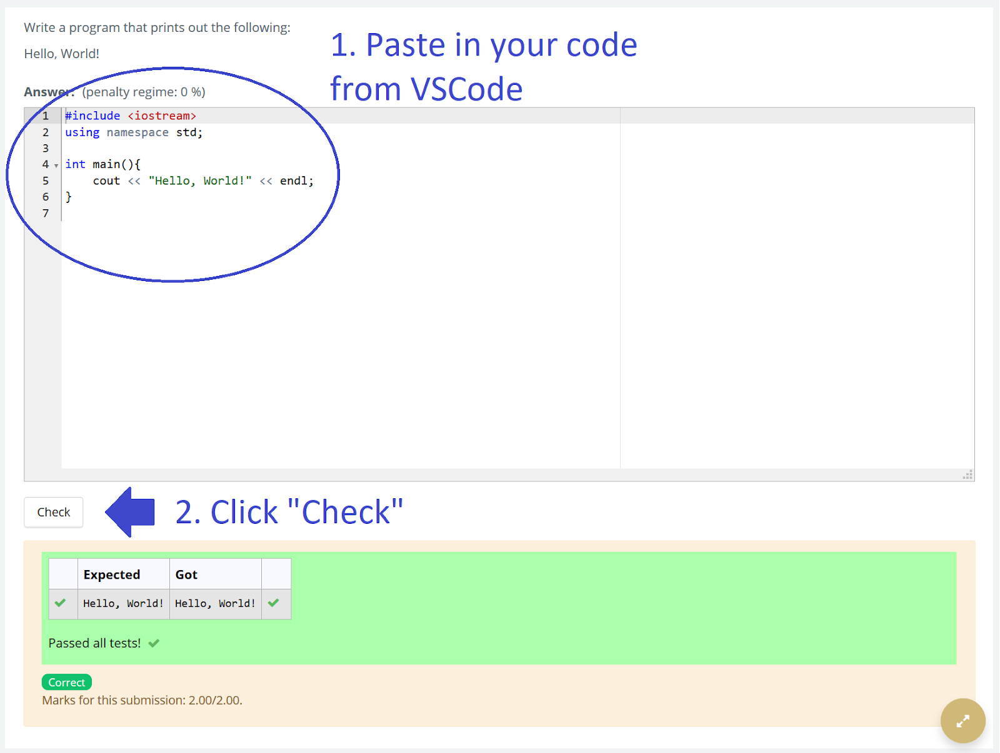
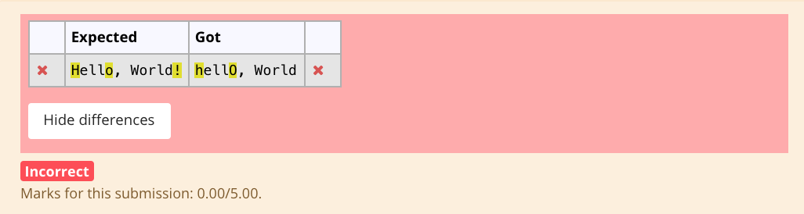
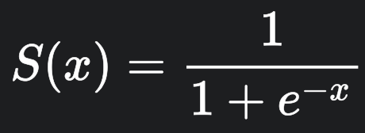

#### **CSCI 1300 CS1: Starting Computing: Homework 2**
#### **Naidu/Yeh - Spring 2022**
#### **Due: Saturday, January 29 by 6:00pm MST**
#### **(3 extra-credit points if Coderunner(Start Early) is submitted by 11:59pm Wednesday, January 26)**

<br/>

# Table of contents
1. [Objectives](#objectives)
2. [Background](#background)
3. [Submission Instructions](#submissions)
4. [Questions](#questions)
    1. [Question 1](#question1)
    2. [Question 2](#question2)
    2. [Question 3](#question3)
    2. [Question 4](#question4)
    2. [Question 5](#question5)
    2. [Question 6](#question6)
    3. [Extra Credit 1](#ec1)
5. [Overview](#overview)
    1. [Checklist](#checklist)
    2. [Grading Rubric](#grading)

# Objectives <a name="objectives"></a>

* Compile and run C++ code 
* Take user inputs and produce outputs
* Understand C++ data types 
* Perform arithmetic operations 


# Background <a name="background"></a>
## Input & Output
The ability to display information to the user and receive input from them is key to making your programs useful. In C++ one way we can achieve this exchange of information is using **cout** (console out) and **cin** (console in) from the iostream library. Whenever you use **cout** or **cin**, you will need to be sure to include the **iostream** (input output stream) library and use the **std** (standard) namespace.

Example Input (User input in **bold**)
```cpp
#include <iostream>
using namespace std;

int main(){
   int number1;
   int number2;
   cout << "Please enter the first number:" << endl;
   cin >> number1;
   cout << "Please enter the second number:" << endl;
   cin >> number2;
   cout << "Sum of numbers: " << number1 + number2 << endl;
}
```
<pre>
Please enter the first number:
<b>1</b>
Please enter the second number:
<b>2</b>
Sum of numbers: 3
</pre>

## Data Types

When programming, we store the variables in our computer's memory, but the computer needs to know what kind of data we want to store in them, since it is not going to occupy the same amount of memory to store a simple number than to store a single letter or a large number, and they are not going to be interpreted the same way. Some commonly used data types in C++ are:

1. int (for integers) 
    * int myInt = 5;  
2. char (for characters)
    * char myChar = 'c';
3. float (for floating-point numbers)
    * float myFloat = 4.4531;
4. double (for double precision floating-point numbers)
    * double myDouble = 4.4531;
5. string (for strings of characters)
    * string myString = “Hello World”;

## Coding Style

### Whitespace and indentation

**Whitespaces:** Whitespace can set things off and reduce the strain on the reader's eyes. Because the compiler ignores whitespace, you're free to place things anywhere you want and format it however you want. Whitespace can come in several forms, including indentation.

**Indenting:** Increase your indentation by one increment of each brace {, and decrease it once on each closing brace }. Place a line break after every {. Use Tab to increase indent and Shit+Tab to decrease indentation.

**Bad Example:** There is no indentation and it is difficult to see where different portions of the code start and stop.
```cpp
int main(){
int number = 0;
while(number < 10){
if(number < 5){
cout << "Less than 5" << endl;
}else{
cout << "Greater than 5" << endl;
}
number++;
}
}
```
Good Example: There is proper indentation and the code is easier to read.
```cpp
int main() {
    int number = 0;
    while(number < 10) {
        if(number < 5) {
            cout << "Less than 5" << endl;
        }
        else {
            cout << "Greater than 5" << endl;
        }
        number++;
    }
}
```

### Naming and variables
**Names:** Give variables descriptive names, such as firstName or homeworkScore. Avoid one-letter names like a or x, except for loop counter variables such as i.

Bad Example:
```cpp
int thing = 16;
double a = 2.2;
string x = "Michael";
}
```

Good Example:
```cpp
int cupsPerGallon = 16;
double lbsPerKilo = 2.2;
string firstName = "Michael";
}
```
**Capitalization:** Name variables and functions with “lower camel-casing”, where the first letter is lowercase and all subsequent words in the name start with a capital letter.

Bad Example:
```cpp
int numberbananas = 10;
double NumberFish = 7;
string AGEOFPERSON = "Michael";
}
```
Good Example:
```cpp
int numberBananas = 10;
double numberFish = 7;
string ageOfPerson = "Michael";
}
```


### Comments
* Your code should be well-commented. Use comments to explain what you are doing, especially if you have a complex section of code. These comments are intended to help other developers understand how your code works. These comments should begin with two backslashes (//) or the multi-line comments (/* … comments here… */) .

* Examples:
    *  Single-line:
    ```cpp
    // CSCI 1300 Spring 2022</br>
    ```
    * Multi-line:
    ```cpp
    /*
    Algorithm:
    Input: two numbers
    Output: sum of input numbers

    1. Ask the user to enter a number
    Save in variable number_1
    2. Ask the user to enter a number
    Save in variable number_2
    3. Compute sum 
    sum = number_1 + number_2
    4. Display sum to user
    */
   ```


# Submission Instructions <a name="submissions"></a>

* **C++ files**. All files should be named as specified in each question, and they should compile and run on VSCode to earn full points. TAs will be grading the style of your code and comments. Please see the coding style under the [background](#background) section. At the top of each file, write your name with the following format:</br>
```cpp
// CSCI 1300 Spring 2022</br>
// Author: Punith Sandhu</br>
// Recitation: 123 – TA name</br>
// Homework 2 - Problem # …
```
Example submission:
```cpp
// example_1.cpp

// CSCI 1300 Spring 2022
// Author: Punith Sandhu
// Recitation: 123 – TA name
// Homework 2 - Problem # ...

#include <iostream>

using namespace std;

int main() {

    int num = 10;
    cout << num << endl;

    return 0;
}
```
When you are finished with all the questions, zip all files. Submit the zip file under the assignment Homework 2 on Canvas.

# Questions <a name="questions"></a>
## **Question 1 (2 points): Hello World** <a name="question1"></a>
The first program that we usually write in any programming language we’re learning is Hello, World. Create a program that prints “Hello, World!” to the screen (the output window in VS Code).

Expected output
```
Hello, World!
```
The file should be named _helloWorld.cpp_

<!-- Here are some suggested steps:

**Step 1: Create a new folder for hw2** <br/>
You can create a new folder in the file explorer of your choice or through the terminal. The example below shows the creation of a new folder using the terminal. You can either access this through VS Code (File -> New Terminal) or through the Mac terminal application, or the Windows Ubuntu shell (pictured below). 



**Step 2: Open the folder in VS Code** <br/> 
Either open VS Code through the program launcher of your choice (MacOS spotlight, Windows menu, etc) or type “code .” in the terminal when you’re in the hw2 directory (as shown in the image above).



**Step 3: Create a new file in the folder, save it as helloWorld.cpp.** <br/>
In VS Code, create a new file. Then save it (File->Save As) as helloWorld.cpp




Alternatively, from the terminal, you can simply enter the command:

``touch helloWorld.cpp``



This creates an empty file named helloWorld.cpp, which will now show up in the VS Code editor window: -->



The .cpp extension on the filename tells VS Code that the file should be read in the C++ programming language. Once you save it, the lines you write in the file should be color-coded to reflect what they do in the program. This is called syntax highlighting.

Here are some suggested steps:

**Step 1: Write Your Code** <br/>
In VS Code, enter the following hello world program:

```cpp
#include <iostream>
using namespace std;

int main(){
    cout << "Hello, World!" << endl
    return 0;
}
```

**Step 2: Running Your Code from Command Line** </br>
Move to the “terminal” tab. Make sure you are inside the hmwk2 directory (you can type pwd to see where you are). Type: </br>
``$ g++ helloWorld.cpp -std=c++17 ``

the ``-std=c++17`` option makes sure that the c++ version used to run the program is c++ 17. If you don’t give this option then the default version(which is usually C++98) is used.


This creates an executable called "a.out" (see screenshot above). You can run it by typing

``$ ./a.out ``

Since no executable name was specified to g++, a.out is chosen by default. You can alternatively use the "-o" option to change the name :

``$ g++ helloWorld.cpp -std=c++11 -o hello``

creates an executable called "hello" (see figure below). You can run it by typing

``$ ./hello``

Notice the output in the same: Hello, World!, followed by the return of the prompt, for new commands.



**Step 3: Submit to CodeRunner**<br/>
Head over to Canvas to the assignment **Homework 2 - Coderunner** in the Week 3 Module. Submit your solution for the first problem and press the Check button. You will see a report on how your solution passed the tests, and the resulting score for the first problem. You can modify your code and re-submit (press “Check” again) as many times as you need to. 


If the code runner says “incorrect”, click the “show difference” button. It will highlight the differences between the expected output and the output your program produced. These outputs should be exactly the same, including upper/lower case, punctuation, and spaces. Otherwise, it’ll mark as incorrect. It’s a computer. It needs to be precise.


## **Question 2 (3 points): Hello You!** <a name="question2"></a>
If a program is more interactive, it’s fun! Create a program that takes a name and prints _“Hello, \<name>!”_. Your output should be exactly the same as below, including the prompt for the user input.

Expected output (**bold** is user input)
<pre>
Enter your name: 
<b>Malvika</b>
Hello, <b>Malvika</b>! 
</pre>

The file should be named as _helloYou.cpp_. Don’t forget to head over to the Homework 2 - Coderunner assignment on Canvas and paste your solution in the answer box! 


## **Question 3 (4 points): Almond Milk** <a name="question3"></a>
_Note: You've already written psuedocode of this problem in Homework 1: Problem 1, you need to convert it to C++ code to solve this question._

While shopping over the weekend for almond milk, you discover that all the almond milk cartons have square bases and varying heights. Write a program which takes user inputs for the side length of the square base of the carton in inches and the height of the carton in inches and outputs how many ounces a carton holds. You can use the following formula to convert cubic inches to ounces:

```
ounces = 0.55 * cubic inches
```

Hint: you should calculate cubic inches from the cartons dimensions before calculating ounces.

The output should be the volume of the carton in ounces formatted with a two-digit precision as shown below. You can use the setprecision() function with the fixed manipulator from the <iomanip> library to do so.

**--- Sample run ---:** <br/>
```
What is the side length of the base of the carton in inches? 
2 
What is the height of the carton in inches? 
4 
The carton has a volume of 8.80 ounces.
```
The file should be named as _almondMilk.cpp_. Don’t forget to head over to the Homework 2 - Coderunner assignment on Canvas and paste your solution in the answer box! 
## **Question 4 (8 points): Snowfall** <a name="question4"></a>
_Note: You've already written psuedocode of this problem in Homework 1: Problem 2, you need to convert it to C++ code to solve this question._

You’re planning a ski trip for later this semester! You want to know how much snow each Colorado resort will have by that time.

Write a program to estimate the number of inches of snow Breckenridge, Vail, and Copper Mountain will have after a certain number of days (`X`) and display the output. `X` will be taken as a user input. Currently, there are 28 inches in Breckenridge, 33 inches at Vail, and 55 at Copper Mountain.

The resorts have provided us with the snowfall and melt rate predictions per day (mentioned below) to come up with an accurate estimation. Assume these rates stay the same for all future days. **The rates do not depend on the current number of inches at each resort.**

**Hint: The calculated snow depth cannot be negative.**

| **Resort**      | **Snowfall rate (inches/day)** | **Melt rate (inches/day)** |
| --------------- | ------------------------------ | -------------------------- |
| Breckenridge    | 15                             | 4                          |
| Vail            | 11                             | 7                          |
| Copper Mountain | 3                              | 2                          |
 
**--- Sample run ---:** <br/>
```
How many days in the future would you like a prediction for?
10
Breckenridge will have 138 inches, Vail will have 73 inches, and Copper Mountain will have 65 inches.
```
The file should be named as _snowfall.cpp_. Don’t forget to head over to the Homework 2 - Coderunner assignment on Canvas and paste your solution in the answer box! 

## **Question 5 (8 points): Convert wizarding currency** <a name="question5"></a>

In the wizarding world, currency conversion is as given below:
| | |
|-|-|
| 1 Sickle | 29 Knuts |
| 1 Galleon | 17 Sickles |

Write a program that takes a number of Knuts as user input (as an integer) and converts it to the number of whole Galleons, Sickles, and Knuts as shown below. The conversion information between these measurement metrics is provided in the table above. You should convert the number of Knuts in such a way that maximizes the whole number of Galleons and Sickles.


Expected output 1 (**bold** is user input) 
<pre>
Enter the number of Knuts:
<b>32</b>
0 Galleons(s) 1 Sickle(s) 3 Knut(s)
</pre>

Expected output 2 (**bold** is user input) 
<pre>
Enter the number of Knuts:
<b>3000</b>
6 Galleon(s) 1 Sickle(s) 13 Knut(s)
</pre>


The file should be named as _convertCurrency.cpp_. Don’t forget to head over to Coderunner on Canvas and paste your solution in the answer box!


## **Question 6 (5 points): Calculating the sigmoid** <a name="question6"></a>

Write a program that takes a real number x as the input (x is of type double) and computes its sigmoid value. The sigmoid function takes an input x of any real number and returns an output value in the range of -1 and 1 . The sigmoid can be computed using mentioned below.


<!--  -->


For e<sup>z</sup> use the function exp(), which is available in #include \<cmath>.

Expected output 1 (**bold** is user input)
<pre> 
Enter a value for x:
<b>1</b>
The sigmoid for x=1 is 0.731059
</pre>

Expected output 2 (**bold** is user input) 
<pre>
Enter a value for x:
<b>10</b>
The sigmoid for x=10 is 0.999955
</pre>

The file should be named as calcSigmoid.cpp. Don’t forget to head over to Coderunner on Canvas and paste your solution in the answer box!

## **Extra Credit: Question 1 (3 points): Convert length** <a name="ec1"></a>
Write a program that takes a number of millimeters as user input (as an integer) and converts it to meters, centimeters, and millimeters as shown below. You should convert the amount of length in such a way that maximizes the whole number of meters and centimeters.


Expected output 1 (**bold** is user input) 
<pre>
Enter the number of millimeters:
<b>62</b>
0 meter(s) 6 centimeter(s) 2 millimeter(s)
</pre>

Expected output 2 (**bold** is user input) 
<pre>
Enter the number of millimeters:
<b>3671</b>
3 meter(s) 67 centimeter(s) 1 millimeter(s)
</pre>

The file should be named as _convertLength.cpp_. Don’t forget to head over to the Homework 2 - Coderunner assignment on Canvas and paste your solution in the answer box!


# Homework 2 overview  <a name="overview"></a>
## Checklist <a name="checklist"></a>
Here is a checklist for submitting the assignment:
1. Use your solutions in VS Code to complete the **Homework 2 - Coderunner** assignment on Canvas (Modules → Week 3). 
    * Remember that submitting **Homework 2 - Coderunner** (Start Early) by Wednesday, January 26 at 11:59pm will give extra credit! That assignment is the first two questions of **Homework 2 - Coderunner**.
    * For additional extra credit, submit the extra credit question to **Homework 2 - Coderunner** (Extra Credit).
2. Submit one zip file to the **Homework 2** assignment on Canvas. The zip file should be named, **hmwk2_lastname.zip**. It should have the following 6 files: 
    * helloWorld.cpp 
    * helloYou.cpp
    * almondMilk.cpp
    * snowfall.cpp
    * convertCurrency.cpp
    * calcSigmoid.cpp
    * Extra-credit: convertLength.cpp


## Grading Rubric <a name="grading"></a>

| **Criteria**                                | Points |
| ------------------------------------------- | ------ |
| Question 1                  | 2     |
| Question 2                  | 3     |
| Question 3                  | 4     |
| Question 4                  | 8     |
| Question 5                  | 8     |
| Question 6                  | 5     |
| C++ files zip submission (compiles and runs, style and comments)| 10 |
| Recitation attendance (Week 3)*             | -6    |
| Total                                       | 40     |
| Extra Credit - Question 1                | 3     |

* If your attendance is not recorded, you will lose points. Make sure your attendance is recorded on Canvas.
